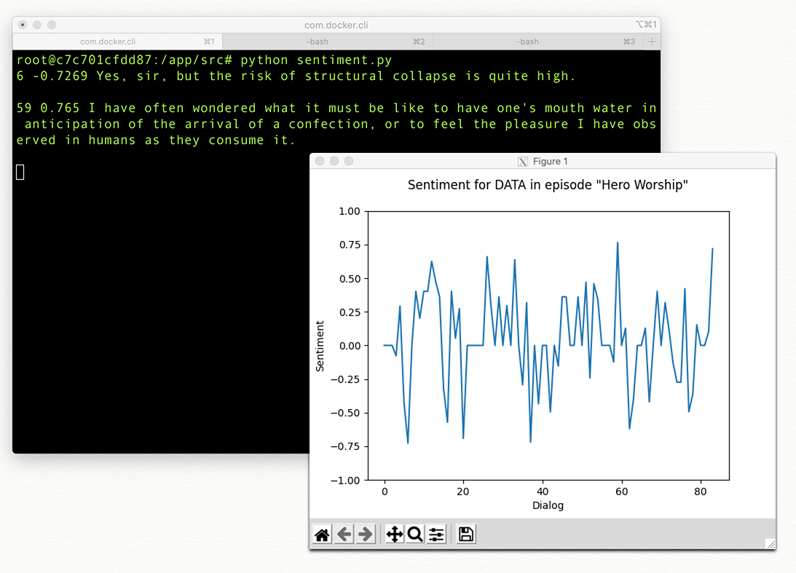

# Visualize Data

This repository is part of a Thing-a-Week challenge. This week’s theme is:

>  Visualize some data. It's a bit broad. You can use charts and graphs, but
also map out a game level using a Cartesian grid, or whatever. Be creative.

Literally "visualize some Data" by graphing the results of sentiment analysis
on dialog for the character Data from Star Trek: The Next Generation.

**Notes:**

Transcript taken from [www.chakoteya.net](http://www.chakoteya.net/) and manually
cleaned.

Clicking a data point prints the line of dialog to the console.

---

